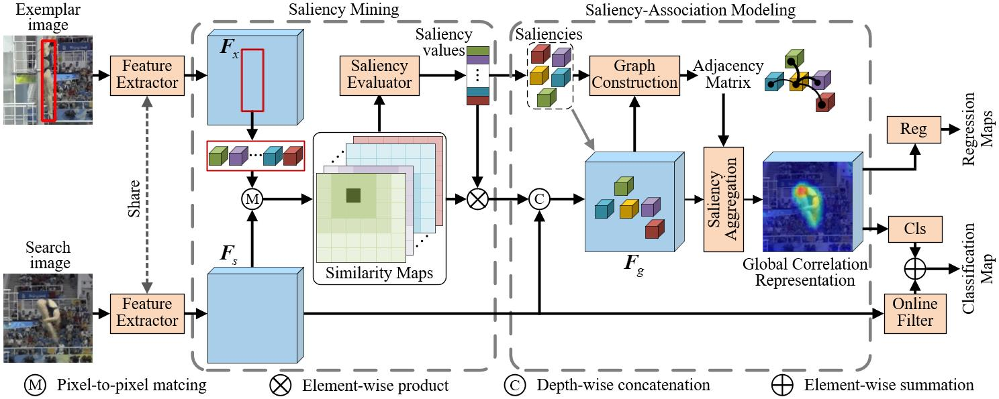

# SAOT
The official implementation of the paper [**Saliency-Associated Object Tracking**](https://arxiv.org/abs/2108.03637) (ICCV2021).


## Highlights

### Strong Performance
| Dataset | LaSOT (AUC)| GOT-10K (AO)| OTB2015 (AUC)| VOT2018 (EAO) |
|---|---|---|---|---|
|**SAOT**|**0.616**|**0.640**|**0.714**|**0.501**|
|Ocean|0.560|0.611|0.684|0.489|
|DiMP|0.568|0.611|0.686|0.440|

### Real-time Speed
SAOT runs at about **29 FPS** on an RTX 2080 GPU.

## Model Zoo & Raw Results
The pre-trained model and raw results are provided in [model zoo](https://drive.google.com/drive/folders/1T5F4JsZ-P-vzzUr5KXJxw853LTUO_lmb?usp=sharing) and [raw results](https://drive.google.com/drive/folders/1_x6mlr0rVbF4sUuasCgIxYINvOqqHCJq?usp=sharing), respectively. 


## Installation

#### Clone the GIT repository.  
```bash
git clone https://github.com/ZikunZhou/SAOT.git
```
   
#### Clone the submodules.  
In the repository directory, run the commands:  
```bash
git submodule update --init  
```
#### Install dependencies
Following the [detailed installation instructions](INSTALL.md) to install the dependencies.


## Testing
Download the pre-trained networks.
Activate the conda environment and run the script pytracking/test_saot_fs.py.  
```bash
conda activate SAOT
cd pytracking
python test_saot_fs.py saot saot_otb --dataset OTB2015
```

## Training
Download the training datasets.
Activate the conda environment and run the script ltr/run_training.py.
```bash
conda activate SAOT
cd ltr
python run_training.py dimp saot
```

## Acknowledgments
Thanks for the [PyTracking](https://github.com/visionml/pytracking) and [Pysot](https://github.com/STVIR/pysot.git) libraries, which helps us to quickly implement our ideas.
